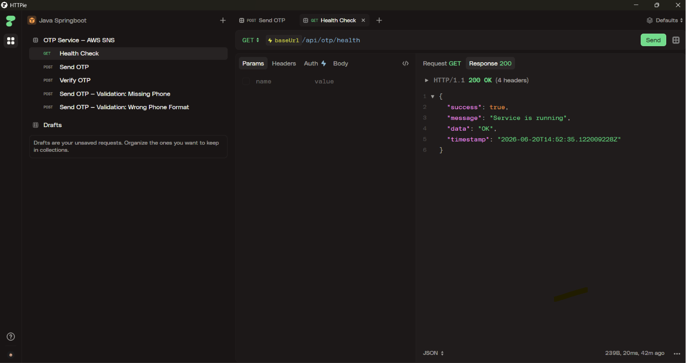
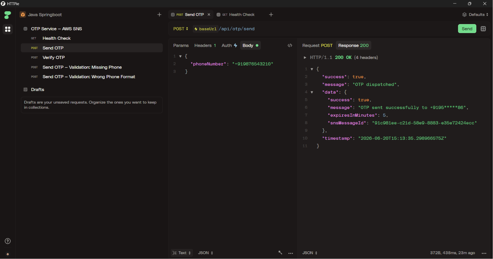
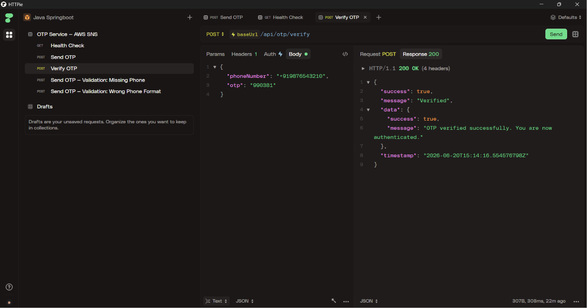

<div align="center">
# OTP Service — AWS SNS + Spring Boot
 
Production-grade SMS OTP service built with Spring Boot 3 & AWS SNS.
Send and verify one-time passwords via REST API — fully dockerized, no local Java needed.
 


 
</div>
---
 
## API Screenshots
 
### Health Check

<div align="center"><em>GET /api/otp/health — confirms the service is up and running</em></div>

### Send OTP

<div align="center"><em>POST /api/otp/send — triggers an SMS to the given phone number via AWS SNS</em></div>

### Verify OTP

<div align="center"><em>POST /api/otp/verify — validates the OTP entered by the user</em></div>
---
 
## Project Structure

```
otp-service/
├── src/main/java/com/otpservice/
│   ├── OtpServiceApplication.java     # Entry point
│   ├── config/
│   │   └── AwsConfig.java             # SnsClient bean (reads env vars)
│   ├── controller/
│   │   └── OtpController.java         # REST routes: /send, /verify, /health
│   ├── service/
│   │   ├── OtpService.java            # Business logic (generate → send → verify)
│   │   └── SmsService.java            # AWS SNS wrapper
│   ├── util/
│   │   └── OtpStore.java              # In-memory OTP store (swap with Redis in prod)
│   ├── dto/                           # Request / Response POJOs
│   └── exception/                     # Custom exceptions + global handler
├── Dockerfile                         # Multi-stage build (JDK builder → JRE runtime)
├── docker-compose.yml                 # Easy local spin-up
├── .env.example                       # Template for env vars
└── pom.xml                            # Maven deps: Spring Boot 3.2, AWS SDK v2
```

---

## Quick Start (Docker only — no Java/Maven needed locally)

### Step 1 — Set up environment

```bash
cp .env.example .env
# Edit .env with your real AWS credentials
```

Your `.env` file:
```
AWS_ACCESS_KEY_ID=AKIAxxxxxxxxxxxxxxxx
AWS_SECRET_ACCESS_KEY=xxxxxxxxxxxxxxxxxxxxxxxxxxxxxxxxxxxxxxxx
AWS_REGION=ap-south-1
OTP_EXPIRY_MINUTES=5
OTP_LENGTH=6
OTP_MAX_ATTEMPTS=3
SMS_SENDER_ID=OTPSvc
```

### Step 2 — Build Docker image

```bash
# Build only
docker build -t otp-service:latest .

# Or use docker-compose (builds + runs)
docker-compose up --build
```

### Step 3 — Run the container

```bash
# With docker-compose (recommended)
docker-compose up

# Or manually with env vars
docker run -p 8080:8080 \
  -e AWS_ACCESS_KEY_ID=your_key \
  -e AWS_SECRET_ACCESS_KEY=your_secret \
  -e AWS_REGION=ap-south-1 \
  otp-service:latest
```

Service starts at: `http://localhost:8080`

---

## API Reference

### Health Check
```
GET /api/otp/health
```
Response:
```json
{ "success": true, "message": "Service is running", "data": "OK" }
```

---

### Send OTP
```
POST /api/otp/send
Content-Type: application/json

{
  "phoneNumber": "+919876543210"
}
```

Success Response `200`:
```json
{
  "success": true,
  "message": "OTP dispatched",
  "data": {
    "success": true,
    "message": "OTP sent successfully to +9198*****10",
    "expiresInMinutes": 5,
    "snsMessageId": "abc123-..."
  },
  "timestamp": "2024-03-15T10:30:00Z"
}
```

---

### Verify OTP
```
POST /api/otp/verify
Content-Type: application/json

{
  "phoneNumber": "+919876543210",
  "otp": "482910"
}
```

Success `200`:
```json
{
  "success": true,
  "message": "Verified",
  "data": {
    "success": true,
    "message": "OTP verified successfully. You are now authenticated."
  }
}
```

Failure `400`:
```json
{
  "success": false,
  "error": "Invalid OTP. Please check and try again."
}
```

---

## AWS Setup Checklist

1. **IAM User** — Create an IAM user with `AmazonSNSFullAccess` policy (or scoped to `sns:Publish` only)
2. **Exit Sandbox** — By default SNS SMS sandbox only delivers to verified numbers.
   Go to: AWS Console → SNS → Text messaging (SMS) → Request production access
3. **DLT Registration** (India only) — For +91 numbers, TRAI mandates DLT registration for commercial SMS
4. **Phone format** — Always E.164: `+91XXXXXXXXXX`

---

## Production Upgrades (TODOs)

| Current | Production Swap |
|---|---|
| `ConcurrentHashMap` OTP store | Redis with TTL (`spring-data-redis`) |
| Static AWS credentials | IAM Role on EC2/ECS (no keys needed) |
| In-memory rate limiting | Redis-based rate limiter per phone number |
| Single instance | Kubernetes Deployment + HPA |

---

## Quick cURL Test

```bash
# Send OTP
curl -X POST http://localhost:8080/api/otp/send \
  -H "Content-Type: application/json" \
  -d '{"phoneNumber": "+919876543210"}'

# Verify OTP (use the OTP received on phone)
curl -X POST http://localhost:8080/api/otp/verify \
  -H "Content-Type: application/json" \
  -d '{"phoneNumber": "+919876543210", "otp": "482910"}'
```
